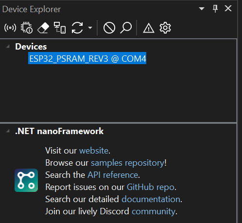

# Getting started with ESP32-CAM using .NET nanoFramework  

## Prerequisites
- Install Visual Studio nanoFramework extension (Visual Studio 2022 -> Extensions -> .NET nanoFramewok Extension)
- Install nanoff ``` dotnet tool install -g nanoff ```
- Connect ESP32-CAM board via USB.  Check which COM port it is using (from Windows device manager)
- Flash nanoFramewok firmeware (assuming the board is connected on COM4 port) ``` nanoff --platform esp32 --serialport COM4 --update ```
  

-  Make sure nanoff can see the device now:  ``` nanoff --listdevices ```
    

## Hello World 
- Visual Studio -> new project -> search for "nano" -> choose "Blank Application (.NET nanoFramework). Give the project the name "HelloWorld"
- Add nuget package: **nanoFramework.System.Device.Gpio**
- Add the following code (blinking LED):
  ```
    public class Program
    {
        private static GpioController _gpioController;

        public static void Main()
        {
            _gpioController = new GpioController();

            GpioPin led = _gpioController.OpenPin(33, PinMode.Output); // 33 is the on-board LED

            led.Write(PinValue.Low);

            while (true)
            {
                led.Toggle();
                Thread.Sleep(1000);
            }


        }
    }
  ```
- Connect the device via USB, and open Device Explorer in Visual Studio (View -> Other Windows -> Device Explorer).  Make sure the device is listed. 
  
- Click "Ping Device" and check Output window for the following message to make sure Visual Studio can communicate the device.
  

- Press F5 to start uploading the sketch and debug.


